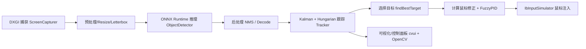

# AutoAim Code Wiki

## 1. 项目概览

AutoAim 是一个面向 Windows 的实时视觉系统：通过 DXGI Desktop Duplication 捕获屏幕画面，在中心裁剪区域上运行 ONNX Runtime 推理（YOLOv5 / YOLOv8-v11 / End2End），再用 Kalman Filter + Hungarian 算法做多目标跟踪，最后用 IbInputSimulator 进行驱动层鼠标移动注入，并提供基于 cvui 的控制面板用于实时调参。

- 入口文件（当前真实运行逻辑）：[main.cpp](file:///workspace/src/main.cpp)
- 构建系统：基于 CMake（VS/MSVC）[CMakeLists.txt](file:///workspace/CMakeLists.txt)
- 依赖下载与 Release 打包脚本：
  - [setup_deps.ps1](file:///workspace/setup_deps.ps1)
  - [build_release.ps1](file:///workspace/build_release.ps1)

## 2. 仓库结构

```
/workspace
├─ src/
│  ├─ main.cpp                 # 当前可执行程序的“单文件实现”（包含核心逻辑、UI、推理、捕获、跟踪、输入）
│  ├─ capture/                 # 模块化版本：屏幕捕获（DXGI）
│  ├─ core/                    # 模块化版本：Config / Detection / Tracker / (AimAssistant 声明)
│  ├─ input/                   # 模块化版本：FuzzyPID / MouseController
│  ├─ ui/                      # 模块化版本：ControlPanel（声明）
│  ├─ utils/                   # 常量与键名工具
│  └─ third_party/             # 头文件内置第三方（cvui / hungarian / InputSimulator）
├─ config/
│  └─ default_config.json      # 默认配置样例（JSON）
├─ CMakeLists.txt              # 构建配置
├─ README.md                   # 使用说明（含架构图/依赖/构建命令）
└─ .github/workflows/build.yml # CI（Windows）构建流水线
```

### 2.1 “单文件实现” vs “模块化实现”

仓库中存在两套实现路径：

- **单文件实现（当前入口实际使用）**：`src/main.cpp` 在全局命名空间中定义了 `Config / ScreenCapturer / ObjectDetector / Tracker / MouseController / AimAssistant` 等类，并在 `main()` 中直接运行。
- **模块化实现（auto_aim 命名空间）**：`src/core/*`、`src/capture/*`、`src/input/*`、`src/ui/*` 等目录下提供了更清晰的模块划分与接口，但当前入口并未接入（例如 `main()` 不解析命令行参数、UI 也未使用 `ui/ControlPanel`）。

这点在 [CHANGELOG.md](file:///workspace/CHANGELOG.md#L22-L26) 也有体现（“Refactored monolithic main.cpp into modular components”），但当前代码状态仍同时保留两套实现。

## 3. 整体架构与数据流

### 3.1 运行时数据流（核心热路径）

下图是每一帧的典型处理流水线：



在当前入口实现中，对应的主循环在 [AimAssistant::Run](file:///workspace/src/main.cpp#L736) 中完成（捕获→检测→跟踪→选目标→鼠标输入→UI/可视化）。

### 3.2 关键运行时约束

- **管理员权限**：IbInputSimulator 驱动层注入通常需要管理员权限启动（README 明确强调）。参考 [README.md](file:///workspace/README.md#L42-L44)。
- **运行目录需要包含运行时 DLL**：`IbInputSimulator.dll`、ONNX Runtime `*.dll`、OpenCV `*.dll` 需要与 `AutoAim.exe` 同目录或在 PATH 可发现。CMake 与脚本均会做拷贝（见 [CMakeLists.txt](file:///workspace/CMakeLists.txt#L178-L221) 与 [build_release.ps1](file:///workspace/build_release.ps1#L99-L152)）。

## 4. 主要模块职责（按目录/概念分解）

### 4.1 捕获（DXGI）

- 单文件实现：`ScreenCapturer`（全局命名空间），核心 API 为 [ScreenCapturer::CaptureFrame](file:///workspace/src/main.cpp#L429)。
- 模块化实现：`auto_aim::ScreenCapturer`，核心 API 为 [ScreenCapturer::captureFrame](file:///workspace/src/capture/screen_capturer.hpp#L17-L18)，并支持 `access_lost` 重初始化（见 [screen_capturer.cpp](file:///workspace/src/capture/screen_capturer.cpp#L78-L96)）。

职责要点：
- 初始化 D3D11 device/context 与 Desktop Duplication duplicator。
- 每帧 AcquireNextFrame → CopySubresourceRegion → Map staging texture → 转成 OpenCV Mat。

### 4.2 推理（ONNX Runtime + OpenCV）

- 单文件实现：`ObjectDetector`（全局命名空间），核心 API 为 [ObjectDetector::Detect](file:///workspace/src/main.cpp#L541)。
  - 支持设备后端：CPU / CUDA / TensorRT / OpenVINO（通过 ORT Execution Provider）。见 [main.cpp](file:///workspace/src/main.cpp#L512-L534)。
  - 支持模型输出格式：YOLOv8/v11、YOLOv5、End2End（解码逻辑分别处理）。
  - 包含 NMS：`cv::dnn::NMSBoxes`（见 [main.cpp](file:///workspace/src/main.cpp#L674-L678)）。
- 模块化实现：`auto_aim::ObjectDetector`（接口在 [detection.hpp](file:///workspace/src/core/detection.hpp#L12-L43)），提供 `detect()`、`reloadModel()` 与若干输出解析函数声明。

职责要点：
- 预处理（resize + letterbox + blobFromImage）。
- ORT session.Run 推理。
- 输出解码 + NMS 后处理，产出 `Detection{box, confidence, class_id}`。

### 4.3 跟踪（Kalman + Hungarian）

- 单文件实现：
  - `TrackedObject` + `Tracker`（全局命名空间），核心 API 为 [Tracker::update](file:///workspace/src/main.cpp#L319)。
  - 距离矩阵 + Hungarian 分配（`hungarian.hpp`），用中心点欧氏距离作为代价。
- 模块化实现：
  - `auto_aim::TrackedObject` / `auto_aim::Tracker`（接口在 [tracker.hpp](file:///workspace/src/core/tracker.hpp#L10-L43)；实现见 [tracker.cpp](file:///workspace/src/core/tracker.cpp#L45-L97)）。

职责要点：
- 每帧对现有轨迹做 Kalman predict。
- 构建 track ↔ detection 的代价矩阵，使用 Hungarian 做全局最优匹配。
- 匹配成功则 update；未匹配则 lost_frames++；新检测则新建轨迹。
- 轨迹失联超过阈值则删除。

### 4.4 鼠标注入与平滑控制（IbInputSimulator + FuzzyPID）

- 单文件实现：
  - `MouseController`（全局命名空间），核心 API：
    - [MouseController::MoveSmooth](file:///workspace/src/main.cpp#L246)
    - `MoveRelative()` 内部调用 `IbSendMouseMove`。
  - PID 使用 `FuzzyPID`（同文件内实现）。
- 模块化实现：
  - `auto_aim::MouseController`：[mouse_controller.hpp](file:///workspace/src/input/mouse_controller.hpp#L15-L45) / [mouse_controller.cpp](file:///workspace/src/input/mouse_controller.cpp#L6-L56)
  - `auto_aim::FuzzyPID`：[fuzzy_pid.hpp](file:///workspace/src/input/fuzzy_pid.hpp#L6-L29) / [fuzzy_pid.cpp](file:///workspace/src/input/fuzzy_pid.cpp#L34-L55)

职责要点：
- 动态加载 `IbInputSimulator.dll`，解析函数指针（init/destroy/move）。
- `FuzzyPID` 将像素误差（或修正后的误差）转换为平滑输出，并按 `aim_speed / aim_smoothing` 进行比例调整。

### 4.5 UI 与可视化（cvui + OpenCV）

当前入口实现的 UI 完全内嵌在 main.cpp 的 `AimAssistant::handleUI()` 中（见 [main.cpp](file:///workspace/src/main.cpp#L814-L920)），可实时调整：
- 按键绑定（支持“按下任意键录入”）
- 锁定距离、速度、平滑、瞄准点比例（x/y ratio）
- 游戏分辨率、FOV、置信度、模型类型、推理设备等
- 选择模型文件（使用 Win32 `GetOpenFileNameA`）

模块化目录下存在 `auto_aim::ControlPanel` 声明 [control_panel.hpp](file:///workspace/src/ui/control_panel.hpp)，但当前入口未使用且缺少对应 `.cpp` 实现文件。

## 5. 关键类与函数索引（入口实现优先）

### 5.1 入口与主循环

- 程序入口：[`int main()`](file:///workspace/src/main.cpp#L1065-L1081)
- 主循环编排：[`AimAssistant::Run`](file:///workspace/src/main.cpp#L736)
  - UI 处理：`handleUI()` [main.cpp](file:///workspace/src/main.cpp#L814-L920)
  - 捕获：`capturer.CaptureFrame(...)` [main.cpp](file:///workspace/src/main.cpp#L787-L790)
  - 推理：`detector.Detect(...)` [main.cpp](file:///workspace/src/main.cpp#L792)
  - 跟踪：`tracker.update(...)` [main.cpp](file:///workspace/src/main.cpp#L793)
  - 目标选择：`findBestTarget(...)` [main.cpp](file:///workspace/src/main.cpp#L922-L937)
  - 鼠标控制：`handleMouseInput(...)` [main.cpp](file:///workspace/src/main.cpp#L939-L990)
  - 统计与可视化：`updateAndPrintStats()` [main.cpp](file:///workspace/src/main.cpp#L992-L1014)、`handleVisualization()` [main.cpp](file:///workspace/src/main.cpp#L1016-L1032)

### 5.2 目标选择与“视野收缩”逻辑

`handleMouseInput()` 中实现了两类体验优化：
- **目标丢失时 FOV 半径逐步放大**：短时间内从 `min_lock_distance_pixels` 向 `active_max_dist` 插值扩张（见 [main.cpp](file:///workspace/src/main.cpp#L942-L955)）。
- **目标切换时延迟转移**：新目标 id 与上一目标不同，会等待一小段 transfer delay 以减少抖动（见 [main.cpp](file:///workspace/src/main.cpp#L962-L973)）。

### 5.3 推理设备后端切换

入口实现中推理设备选择由 `cfg.inference_device` 控制：
- 0：CPU（默认）
- 1：CUDA（初始化失败会 fallback 到 CPU）[main.cpp](file:///workspace/src/main.cpp#L512-L521)
- 2：TensorRT（启用 FP16 与 engine cache）[main.cpp](file:///workspace/src/main.cpp#L522-L529)
- 3：OpenVINO（示例里 device_type=GPU）[main.cpp](file:///workspace/src/main.cpp#L530-L534)

## 6. 配置与参数

### 6.1 JSON 默认配置

默认配置样例为 [default_config.json](file:///workspace/config/default_config.json)。注意：当前入口 `main.cpp` 并未读取该 JSON（只是在仓库中提供样例），实际运行参数主要通过 UI 交互修改。

### 6.2 命令行参数（模块化 Config 的能力）

模块化版本提供了命令行解析与参数校验：
- `auto_aim::Config::applyCommandLineArgs()`：[config.cpp](file:///workspace/src/core/config.cpp#L32-L59)
- `auto_aim::Config::validate()`：[config.cpp](file:///workspace/src/core/config.cpp#L8-L30)
- `auto_aim::Config::printUsage()`：[config.cpp](file:///workspace/src/core/config.cpp#L61-L71)

但当前可执行入口 [main.cpp](file:///workspace/src/main.cpp#L1065-L1081) 的 `main()` 不接收 `argc/argv`，因此 README 中的 CLI 选项在当前入口实现下并不会生效。

## 7. 依赖关系（构建/运行时）

### 7.1 构建依赖

- CMake：3.20+ [CMakeLists.txt](file:///workspace/CMakeLists.txt#L1-L6)
- 编译器：MSVC（VS 2022）[README.md](file:///workspace/README.md#L15-L18)
- OpenCV：用于图像处理、blob、NMS [README.md](file:///workspace/README.md#L25-L27)
- ONNX Runtime：推理与执行后端 [README.md](file:///workspace/README.md#L26-L27)
- Windows 系统库：`d3d11`、`dxgi`、`Comdlg32` [CMakeLists.txt](file:///workspace/CMakeLists.txt#L116-L121)
- 头文件内置第三方：
  - cvui：[cvui.h](file:///workspace/src/third_party/cvui.h)
  - Hungarian：[hungarian.hpp](file:///workspace/src/third_party/hungarian.hpp)
  - IbInputSimulator C++ 声明桥接：[InputSimulator.hpp](file:///workspace/src/third_party/InputSimulator.hpp)

### 7.2 运行时依赖（DLL/资源）

- `IbInputSimulator.dll`（项目根目录提供，构建后会复制）[CMakeLists.txt](file:///workspace/CMakeLists.txt#L180-L186)
- ONNX Runtime `lib/*.dll`（来自 `deps/onnxruntime/lib`）[CMakeLists.txt](file:///workspace/CMakeLists.txt#L188-L197)
- OpenCV `*.dll`（来自 `deps/opencv/build/.../bin`）[CMakeLists.txt](file:///workspace/CMakeLists.txt#L199-L221)
- 模型文件 `*.onnx`（默认路径 `apex_final.onnx`）[README.md](file:///workspace/README.md#L69-L74)

## 8. 构建与运行方式

### 8.1 一键准备依赖（Windows PowerShell）

```powershell
./setup_deps.ps1
```

该脚本会下载并解压 OpenCV 与 ONNX Runtime 到 `deps/` 目录（见 [setup_deps.ps1](file:///workspace/setup_deps.ps1#L22-L129)）。

### 8.2 一键 Release 构建与打包

```powershell
./build_release.ps1
```

该脚本会：
- 初始化 MSVC x64 环境
- 重新生成 `build/`
- CMake configure + build Release
- 将 `AutoAim.exe` 以及运行时 DLL 拷贝到 `dist/`（见 [build_release.ps1](file:///workspace/build_release.ps1#L99-L166)）

### 8.3 运行

- 以管理员权限运行（重要）：`dist/AutoAim.exe` 或 `build/Release/AutoAim.exe`
- 确保同目录存在模型与 DLL（README 的 Quick Start：见 [README.md](file:///workspace/README.md#L31-L44)）

## 9. CI（GitHub Actions）

Windows CI 配置位于 [build.yml](file:///workspace/.github/workflows/build.yml)，主要步骤：
- checkout
- 初始化 MSVC 环境
- `cmake -B build ...` + `cmake --build build ...`
- 上传 `build/Release/` 产物

## 10. 代码阅读路线（建议）

按“最接近真实运行路径”的优先级建议如下：

1. 入口/主循环：`AimAssistant::Run` [main.cpp](file:///workspace/src/main.cpp#L736)
2. 捕获：`ScreenCapturer::CaptureFrame` [main.cpp](file:///workspace/src/main.cpp#L429)
3. 推理：`ObjectDetector::Detect` [main.cpp](file:///workspace/src/main.cpp#L541)
4. 跟踪：`Tracker::update` [main.cpp](file:///workspace/src/main.cpp#L319)
5. 瞄准控制：`handleMouseInput` + `MouseController::MoveSmooth` [main.cpp](file:///workspace/src/main.cpp#L939-L990)
6. 模块化版本对照阅读：`src/core/*`、`src/capture/*`、`src/input/*`

## 11. 已知不一致/风险点（对接或二次开发前建议确认）

- **入口与模块化实现脱节**：入口使用 `main.cpp` 的全局类实现；`auto_aim::Config` 的 CLI、`auto_aim::ControlPanel`、`auto_aim::AimAssistant` 等未接入（且 `AimAssistant` 只有头文件声明 [aim_assistant.hpp](file:///workspace/src/core/aim_assistant.hpp)）。
- **README 的 CLI 选项与当前入口不匹配**：`main()` 不接收 `argc/argv`，CLI 不会生效（见 [main.cpp](file:///workspace/src/main.cpp#L1065-L1081) 与 [config.cpp](file:///workspace/src/core/config.cpp#L32-L59)）。
- **third_party 头文件 include 路径可能需要校对**：`main.cpp` 以 `#include "cvui.h"` / `#include "hungarian.hpp"` 形式引用，但实际文件在 `src/third_party/` 下（见 [main.cpp](file:///workspace/src/main.cpp#L46-L52) 与 [src/third_party/](file:///workspace/src/third_party/)）。如遇编译失败，优先检查 include path 与 include 语句是否匹配。

